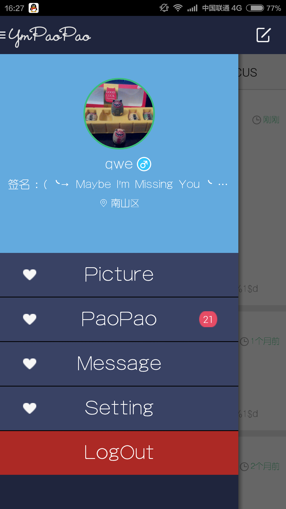
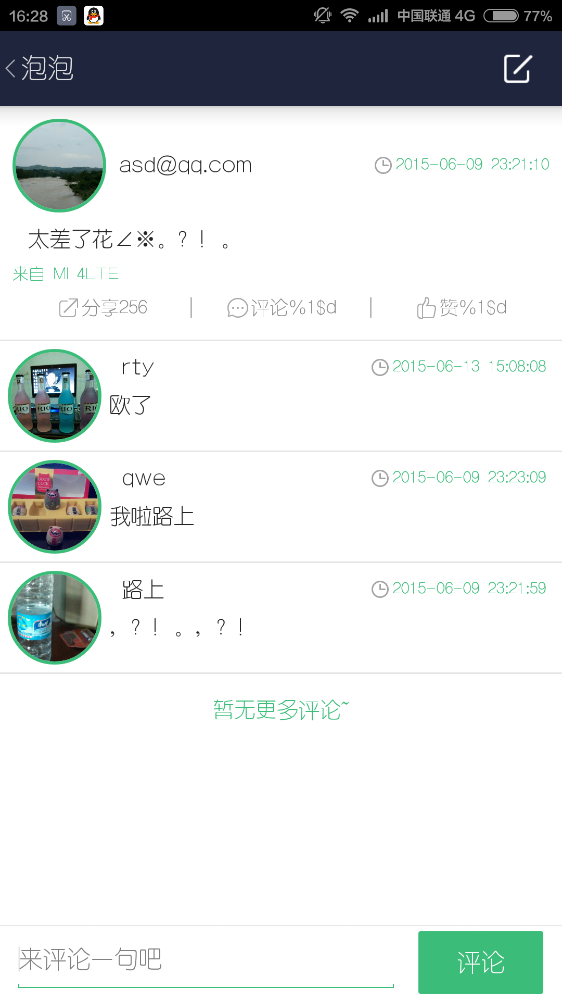
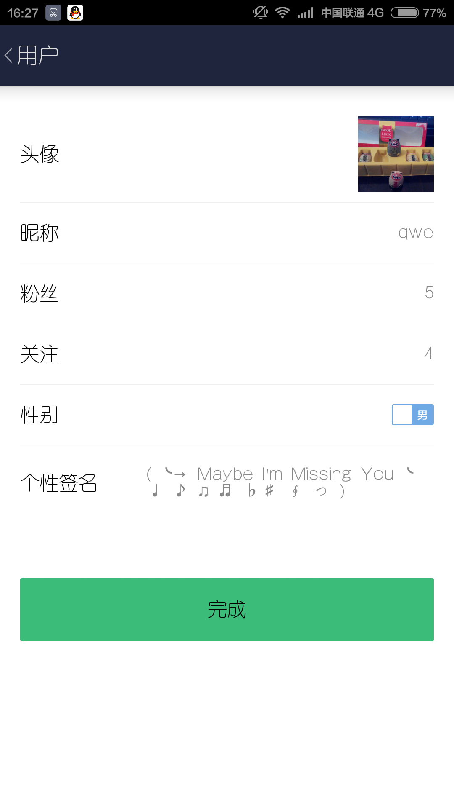
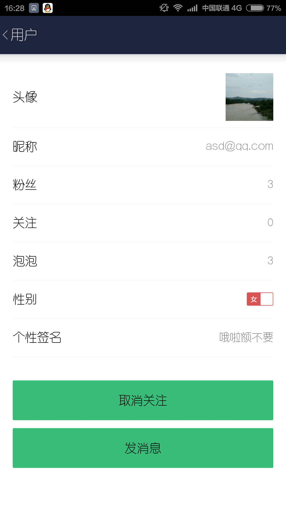
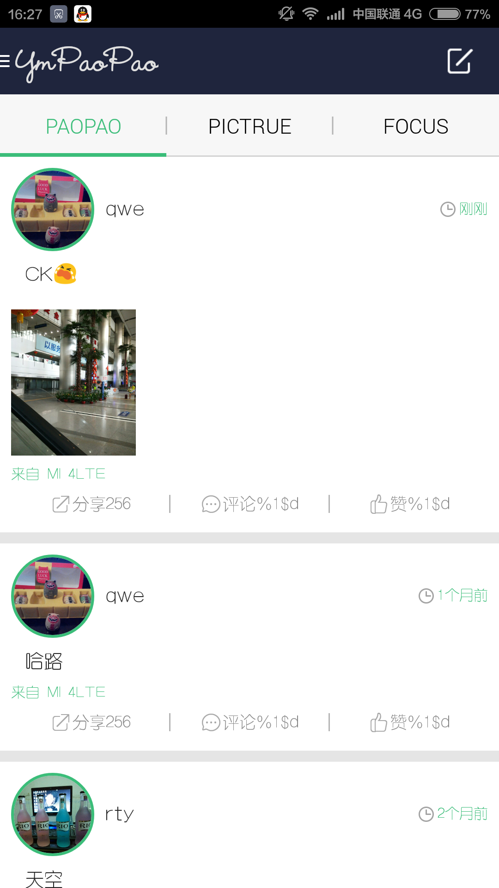
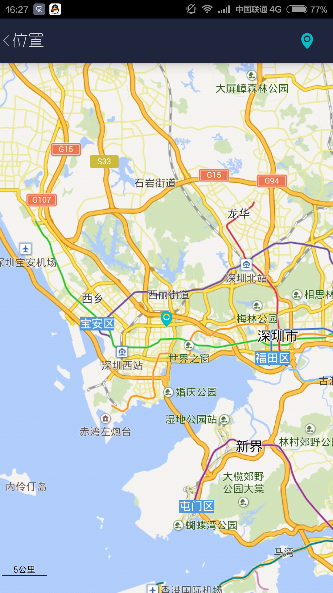

#YmPaoPao
基于Bmob服务。用户注册、登录、发送泡泡、评论、粉丝、关注、图片瀑布流、定位等功能。 

##工具
项目android studio 开发.

##数据状态
基于[Bmob](http://www.bmob.cn/)服务平台管理数据。

##项目状态
很长时间没有做了，其他功能像图片广场，即时消息等还没加上。估计要搁浅了...

##部分截图

                    